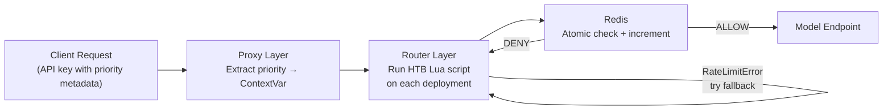

# HTB Priority Rate Limiting: Executive Summary

## The Problem

The LiteLLM proxy had no priority-aware rate limiting. All API keys competed equally for model capacity, so a noisy low-priority consumer could starve VIP users. Fallback models had no priority awareness either.

```
Without HTB:
  VIP user    ──────────────────► 429 (blocked by basic user's traffic)
  Basic user  ──────────────────► 429 (same treatment as VIP)
```

## The Solution

A **Hierarchical Token Bucket (HTB)** system, the same algorithm Linux `tc` uses for network traffic shaping. Each priority level gets a guaranteed fraction of every model's RPM. When a priority is idle, its unused capacity automatically flows to active priorities.

```
Model: 180 RPM total

  prior1 (50%) ──────────── 90 RPM guaranteed
  prior2 (30%) ──────────── 54 RPM guaranteed
  prior3 (20%) ──────────── 36 RPM guaranteed

  When prior3 is idle, its 36 RPM flows to prior1 and prior2 (borrowing)
  Model-wide hard cap of 180 RPM is never exceeded
```

## How It Works



Two layers, each doing one job:

| Layer | What it does | Why it's separate |
|-------|-------------|-------------------|
| **Proxy** (`async_pre_call_hook`) | Extracts priority from API key metadata, stores in a `ContextVar` | Runs once per request, before the router picks a deployment |
| **Router** (`async_pre_call_check`) | Runs the HTB Lua script, raises `RateLimitError` if denied | Runs on every deployment pick, including fallback models |

The `ContextVar` bridges the two layers without modifying any router method signatures.

## Key Terms (only the ones that matter)

**HTB** — Hierarchical Token Bucket. Each priority gets a guaranteed rate and can borrow unused capacity from idle siblings.

**RPM** — Requests Per Minute. The model's total capacity, divided among priorities.

**Demand Counter** — A sliding-window counter incremented *before* the atomic check-and-increment. It reflects how many requests a priority has *attempted* (including denied ones), making a priority's demand visible to siblings immediately. This replaces the previous EWMA approach, which lagged behind reality and caused starvation under concurrent burst.

**Lua Script** — A script that runs atomically inside Redis. It reads counters, computes the borrow ceiling, and increments, all in one step. This eliminates the race condition where multiple requests read the same counter value and all pass.

**Saturation Threshold** — A configurable ceiling (default 1.0, i.e. full model RPM) on borrow headroom. When sum(guaranteed) equals model RPM, the threshold is irrelevant because guaranteed rates always take priority. A value below 1.0 leaves a buffer for priority transitions but may cause under-utilization.

## Configuration

```yaml
litellm_settings:
  priority_reservation:
    prior1: 0.50    # 50% of model RPM guaranteed
    prior2: 0.30    # 30% guaranteed
    prior3: 0.20    # 20% guaranteed
  priority_reservation_settings:
    saturation_threshold: 1.0   # Default: full model RPM available for borrowing

router_settings:
  optional_pre_call_checks:
    - enforce_model_rate_limits
```

Priority names are arbitrary. Weights auto-normalize if they exceed 1.0. Fully backward-compatible when `priority_reservation` is not configured.

## Test Results

### Unit tests: 179 passed, 0 failed

| Test file | Tests | What it covers |
|-----------|-------|----------------|
| `test_priority_reservation_adeo.py` | 29 | HTB enforcement, 429 errors, concurrency, fail-open behavior, starvation regression |
| `test_dynamic_rate_limiter_v3.py` | 7 | Priority weight allocation, concurrent requests, token tracking |
| `test_proxy_rate_limit_provider_field.py` | 39 | Provider attribution in rate limit errors |
| `test_rate_limiter_toctou.py` | 6 | Atomicity, no TOCTOU race, fail-closed on unknown descriptors |
| `test_rate_limit_error_unification.py` | 98 | Unified error type across all proxy rate limiters |

### Simulation: 7 scenarios, model cap never exceeded

Config: 180 RPM model, prior1=50% (90 RPM), prior2=30% (54 RPM), prior3=20% (36 RPM)

| Scenario | prior1 | prior2 | prior3 | Total | Cap hit? |
|----------|--------|--------|--------|-------|----------|
| Low traffic (30 each) | 30 | 30 | 30 | 90 | No (90/180) |
| At capacity (60 each) | 60 | 60 | 60 | 180 | No (180/180) |
| Over capacity (200 each) | 90 | 54 | 36 | 180 | No (180/180) |
| prior1 heavy (500/50/50) | 94 | 50 | 36 | 180 | No (180/180) |
| prior3 heavy (50/50/500) | 50 | 50 | 80 | 180 | No (180/180) |
| prior1 only (500/0/0) | 180 | 0 | 0 | 180 | No (180/180) |
| Burst (1000 each) | 90 | 54 | 36 | 180 | No (180/180) |

Key behaviors confirmed:

- **Guaranteed rates hold under contention**: in the "over capacity" scenario (200 each), each priority received exactly its guaranteed rate (90/54/36 = 180). No priority was starved.
- **Borrowing works for idle siblings**: in the "prior1 only" scenario, prior1 got 180 (well above its 90 guaranteed) by borrowing all idle capacity from prior2 and prior3
- **Borrowing works for surplus demand**: in the "prior3 heavy" scenario, prior3 got 80 (above its 36 guaranteed) by borrowing from prior1 and prior2's surplus capacity
- **No starvation**: prior3 receives its full 36 RPM in every over-capacity scenario, unlike the previous EWMA-only approach which starved it to 0
- **Model cap enforced**: across all 7 scenarios, total allowed requests never exceeded 180 RPM

### Live integration tests (real LLM providers)

Tested against GLM-5.2 (100 RPM, fallbacks to GLM-5.1 and MiniMax) with 4 API keys across 3 priority levels. All priorities received at least their guaranteed RPM, borrowing worked correctly when siblings were idle, and fallback cascade distributed load across models with independent per-model HTB enforcement.

## Code Footprint

| Metric | Value |
|--------|-------|
| Core files modified | 6 |
| Lines added | ~730 |
| Lines removed | ~2400 |
| Net reduction | ~1670 lines |
| Unit tests | 179 passing |
| Dead methods removed | 4 |
| Dead tests removed | 6 |

The net reduction comes from removing the old saturation-based approach (4 unused methods, 6 tests that mocked them) and consolidating the three-phase check-then-decide-then-increment pattern into a single atomic Lua script call.
