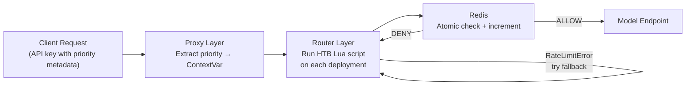

# HTB Priority Rate Limiting: Executive Summary

## Problem

All API keys competed equally for model capacity. A noisy low-priority consumer could starve VIP users, and fallback models had no priority awareness.

## Solution

Hierarchical Token Bucket (HTB) rate limiting, the same algorithm Linux `tc` uses for network traffic shaping. Each priority level gets a guaranteed fraction of every model's RPM. Idle capacity flows to active priorities (borrowing). The model-wide RPM cap is never exceeded.

```
Model: 180 RPM total

  prior1 (50%) ─── 90 RPM guaranteed
  prior2 (30%) ─── 54 RPM guaranteed
  prior3 (20%) ─── 36 RPM guaranteed

  When prior3 is idle → its 36 RPM flows to prior1 and prior2
```

## How It Works



| Layer | What it does | Why it's separate |
|-------|-------------|-------------------|
| **Proxy** (`async_pre_call_hook`) | Extracts priority from API key metadata into a `ContextVar` | Runs once per request, before the router picks a deployment |
| **Router** (`async_pre_call_check`) | Runs the HTB Lua script, raises `RateLimitError` if denied | Runs on every deployment pick, including fallback models |

## Key Concepts

**Demand Counter** — A sliding-window counter incremented *before* the atomic check-and-increment. It reflects how many requests a priority has *attempted* (including denied ones), making demand visible to siblings immediately. This replaces the previous EWMA approach, which lagged behind reality and caused starvation under concurrent burst.

**Lua Script** — Runs atomically inside Redis: reads counters, computes the borrow ceiling, and increments in one step. Eliminates TOCTOU race conditions.

**Saturation Threshold** — Ceiling on borrow headroom (default 1.0 = full model RPM). When `sum(guaranteed)` equals model RPM, the threshold is irrelevant because guaranteed rates always take priority.

## Configuration

```yaml
litellm_settings:
  priority_reservation:
    prior1: 0.50    # 50% of model RPM guaranteed
    prior2: 0.30    # 30% guaranteed
    prior3: 0.20    # 20% guaranteed
  priority_reservation_settings:
    saturation_threshold: 1.0

router_settings:
  optional_pre_call_checks:
    - enforce_model_rate_limits
```

Priority names are arbitrary. Weights auto-normalize if they exceed 1.0. Fully backward-compatible when `priority_reservation` is not configured.

## Test Results

### Unit tests: 179 passed

| Test file | Tests | What it covers |
|-----------|-------|----------------|
| `test_priority_reservation_adeo.py` | 29 | HTB enforcement, 429 errors, concurrency, starvation regression |
| `test_dynamic_rate_limiter_v3.py` | 7 | Priority weight allocation, concurrent requests |
| `test_proxy_rate_limit_provider_field.py` | 39 | Provider attribution in rate limit errors |
| `test_rate_limiter_toctou.py` | 6 | Atomicity, no TOCTOU race |
| `test_rate_limit_error_unification.py` | 98 | Unified error type across all proxy rate limiters |

### Simulation: 7 scenarios, model cap never exceeded

Config: 180 RPM model, prior1=50% (90), prior2=30% (54), prior3=20% (36)

| Scenario | prior1 | prior2 | prior3 | Total | Cap |
|----------|--------|--------|--------|-------|-----|
| Low traffic (30 each) | 30 | 30 | 30 | 90 | 90/180 |
| At capacity (60 each) | 60 | 60 | 60 | 180 | 180/180 |
| Over capacity (200 each) | 90 | 54 | 36 | 180 | 180/180 |
| prior1 heavy (500/50/50) | 94 | 50 | 36 | 180 | 180/180 |
| prior3 heavy (50/50/500) | 50 | 50 | 80 | 180 | 180/180 |
| prior1 only (500/0/0) | 180 | 0 | 0 | 180 | 180/180 |
| Burst (1000 each) | 90 | 54 | 36 | 180 | 180/180 |

Guaranteed rates hold under contention (over capacity: 90/54/36 exactly). Borrowing works both ways (prior1-only got 180; prior3-heavy got 80). No starvation: prior3 receives its full 36 RPM in every over-capacity scenario, unlike the previous EWMA approach which starved it to 0.

### Live integration tests (real LLM providers, real Redis)

Tested against the production gateway with 4 API keys across 3 priority levels, `saturation_threshold=1.0`, and real Redis-backed Lua scripts hitting real vLLM endpoints. Redis flushed between sub-tests.

#### Test 1: Qwen (100 RPM, no fallbacks)

Purest HTB test: no fallback cascade, so denied requests stay denied.

| Sub-test | prior1 | prior2 | prior3 | Total OK | Cap |
|----------|--------|--------|--------|----------|-----|
| 1a: Light (10/key) | 10 | 10 | 20 | 40/40 | 40/100 |
| 1b: Heavy (80/key) | 59 | 29 | 12 | 100/320 | 100/100 |
| 1c: prior1 heavy, others light | 80 | 2 | 4 | 86/86 | 86/100 |
| 1d: prior3 heavy, others light | 2 | 2 | 96 | 100/164 | 100/100 |

Sub-test 1b is the key regression test: prior3 got 12 requests under full contention. The old EWMA algorithm would have starved it to 0 here.

#### Test 2: GLM-5.2 (100 RPM, fallbacks: GLM-5.1 → MiniMax)

Tests HTB across the fallback cascade. Each model has independent HTB state.

| Sub-test | prior1 | prior2 | prior3 | Total OK | Models used |
|----------|--------|--------|--------|----------|-------------|
| 2a: Light (10/key) | 10 | 10 | 20 | 40/40 | GLM-5.2 only |
| 2b: Heavy (80/key) | 80 | 80 | 160 | 320/320 | 100/100/120 across 3 |
| 2c: prior3 only (160) | 0 | 0 | 160 | 160/160 | 100 GLM-5.2, 60 GLM-5.1 |
| 2d: Mixed (80/2/160) | 80 | 2 | 160 | 242/242 | 100/100/42 across 3 |

All 320 requests in 2b succeeded because the fallback chain provided 700 RPM total. HTB was enforced independently per model: GLM-5.2 filled to 100, overflow cascaded to GLM-5.1, then MiniMax.

#### Test 3: GLM-5.2 + Direct Fallback Models

Tests HTB when traffic goes directly to fallback models alongside cascade traffic.

| Sub-test | prior1 | prior2 | prior3 | Total OK | Notes |
|----------|--------|--------|--------|----------|-------|
| 3a: Light (10/key) | 10 | 10 | 20 | 40/40 | All direct, no overflow |
| 3b: Heavy (80/key) | 80 | 80 | 141 | 301/320 | GLM-5.1 served direct + overflow |
| 3c: prior1 on GLM-5.2, prior3 direct | 80 | 2 | 160 | 242/242 | prior3 borrows fully |
| 3d: prior3 split | 0 | 0 | 160 | 160/160 | 80 GLM-5.2, 80 MiniMax |

In 3b, direct prior3 traffic and cascade overflow shared the same HTB pool on GLM-5.1. prior3 got 61 (above its 20 guaranteed via borrowing).

#### Verification summary

| Behavior | Verified |
|----------|----------|
| Guaranteed rates hold under contention | Test 1b: prior3 got 12, not 0 |
| Borrowing when siblings are idle | Test 1c: prior1 80/50, Test 1d: prior3 96/20 |
| No starvation under concurrent burst | Test 1b: all 3 priorities got > 0 |
| Model-wide cap never exceeded | All tests: total OK <= model RPM |
| Independent HTB per fallback model | Test 2b: each model filled independently |
| Direct + cascade traffic share HTB pool | Test 3b: GLM-5.1 served both |
| Fallback cascade distributes load | Test 2b: 320 requests across 3 models |
