# Model Pricing Auto-Discovery: Implementation Plan

## Problem

The discovery controller registers vLLM-hosted models into LiteLLM without any pricing data. LiteLLM's built-in cost calculator looks up `model_prices_and_context_window.json` using a **deterministic exact/case-insensitive match** against a priority ladder of candidate names (`provider/model`, `model`, `split_model`, stripped variants, then regex `fallback_generalizations`).

The deployed model IDs are HuggingFace-style names (e.g. `Qwen/Qwen2.5-32B-Instruct`, `meta-llama/Llama-3.1-8B-Instruct`, `deepseek-ai/DeepSeek-V3`). The JSON keys are provider-prefixed and inconsistently formatted. There are **zero** `hosted_vllm` entries in the JSON and **no** substring or fuzzy matching in LiteLLM's lookup path. Result: every hosted model silently gets $0.00 cost tracking.

This plan describes a pricing resolver that runs at registration time inside the controller, producing `input_cost_per_token` / `output_cost_per_token` values that are injected into the existing `litellm_params` via the `inherited_params` mechanism already used by the reconciler.

---

## No LiteLLM Import

The controller is a lightweight pod (`kubernetes` + `httpx` + `aiohttp` only). Importing `litellm` would pull in a massive dependency tree (Pydantic, httpx, async packages, dozens of provider SDKs). Instead, we copy the minimal patterns we need:

- **JSON loading**: `json.loads(path.read_text())` is the entire LiteLLM loader plus two trivial validation checks (is it a non-empty dict, has the model count not shrunk >50%). We implement our own 3-line loader.
- **Entry schema**: derived from LiteLLM's `ModelInfoBase` TypedDict (`litellm/types/utils.py`), but trimmed to only the fields we read. We use a frozen dataclass, not a TypedDict, for runtime safety.
- **Normalization patterns**: informed by LiteLLM's `_strip_model_name()`, `_get_potential_model_names()`, and `_get_base_bedrock_model()` but reimplemented locally since they're 5-10 lines each and depend on LiteLLM internals.

---

## JSON Structure (verified from `model_prices_and_context_window_backup.json`)

### Top-level shape

```json
{
    "sample_spec": { ... },          // documentation template, NOT a real model; skip
    "<model-name>": { ... },         // one entry per model
    ...
    "fallback_generalizations": {    // regex routing rules; skip during indexing
        "rules": [ ... ]
    }
}
```

Reserved top-level keys to exclude during indexing: `sample_spec`, `fallback_generalizations`.

### Per-entry fields

**Required on every entry** (per LiteLLM's `ModelInfoBase`):
- `litellm_provider` (str): e.g. `"openai"`, `"deepseek"`, `"bedrock"`, `"together_ai"`, `"dashscope"`, `"openrouter"`
- `mode` (str): one of `"chat"`, `"embedding"`, `"completion"`, `"image_generation"`, `"audio_transcription"`, `"audio_speech"`, `"moderation"`, `"rerank"`, `"search"`

**Pricing fields** (what we care about):
- `input_cost_per_token` (float): per-token input cost in USD. Present on most chat/embedding entries.
- `output_cost_per_token` (float): per-token output cost in USD. Present on chat entries; `0.0` for embedding entries.
- `tiered_pricing` (list): used by some providers (e.g. dashscope) instead of flat rates. Each tier has `input_cost_per_token`, `output_cost_per_token`, and `range: [start, end]`. The first tier (`range: [0, X]`) is the base rate. When present, flat `input_cost_per_token`/`output_cost_per_token` are absent.

**Other fields we read for filtering/indexing**:
- `max_input_tokens`, `max_output_tokens`, `max_tokens` (int): context window
- `source` (str): URL documenting the price (useful for logging)

**Fields we ignore**: all `supports_*` booleans, `cache_*_cost` fields, `output_vector_size`, `supported_endpoints`, `supported_regions`, `deprecation_date`, image/audio/video/pixel cost fields.

### Critical edge cases discovered

1. **Entries with NO pricing**: some entries have `litellm_provider` and `mode` but no `input_cost_per_token`, `output_cost_per_token`, or `tiered_pricing`. Example:
   ```json
   "together_ai/Qwen/Qwen2.5-72B-Instruct-Turbo": {
       "litellm_provider": "together_ai",
       "mode": "chat",
       "supports_function_calling": true,
       ...
   }
   ```
   These must be **excluded from the index**. If included, they'd contribute `0.0` to a weighted average and corrupt the result.

2. **Tiered pricing**: dashscope models use `tiered_pricing` with no flat rates. We extract the first tier (range `[0, X]`) as the base rate for indexing:
   ```json
   "dashscope/qwen-flash": {
       "litellm_provider": "dashscope",
       "mode": "chat",
       "tiered_pricing": [
           { "input_cost_per_token": 5e-08, "output_cost_per_token": 4e-07, "range": [0, 256000.0] },
           { "input_cost_per_token": 2.5e-07, "output_cost_per_token": 2e-06, "range": [256000.0, 1000000.0] }
       ]
   }
   ```

3. **Embedding models**: `output_cost_per_token` is `0.0`. This is correct and should not be treated as "no pricing".

4. **Bare vs prefixed keys**: the same model family appears under multiple provider prefixes with different prices:
   - `deepseek-chat` (bare, `litellm_provider: deepseek`)
   - `deepseek/deepseek-v3` (prefixed)
   - `openrouter/qwen/qwen3-coder` (double-prefixed)
   - `qwen.qwen3-coder-480b-a35b-v1:0` (bedrock dotted, with `:0` version suffix)

### Representative entries (for test fixtures)

| JSON key | litellm_provider | mode | input_cost_per_token | output_cost_per_token | Notes |
|----------|-----------------|------|---------------------|----------------------|-------|
| `deepseek-chat` | deepseek | chat | 2.8e-07 | 4.2e-07 | bare key, has cache pricing |
| `dashscope/qwen-flash` | dashscope | chat | (tiered) | (tiered) | tiered_pricing, no flat rates |
| `openrouter/qwen/qwen3-coder` | openrouter | chat | 2.2e-07 | 9.5e-07 | double-prefixed |
| `qwen.qwen3-32b-v1:0` | bedrock_converse | chat | 1.5e-07 | 6e-07 | bedrock dotted, `:0` suffix |
| `together_ai/Qwen/Qwen2.5-72B-Instruct-Turbo` | together_ai | chat | (none) | (none) | NO pricing; must be excluded |
| `amazon.titan-embed-text-v1` | bedrock | embedding | 1e-07 | 0.0 | embedding, output=0.0 |
| `1024-x-1024/dall-e-2` | openai | image_generation | (none) | (none) | image gen; excluded by mode filter |

---

## Design Principles

1. **Vertical slice**: the pricing feature is a self-contained slice (`controller/pricing/`) with its own source, service, models, and client; it plugs into the existing registration flow at a single seam (the `inherited_params` dict). It does not modify the reconciler's plan logic or the controller's watch loop.
2. **Multiple matchers, aggregate score**: no single matching strategy is reliable across the diversity of model names. The resolver runs several independent matchers, each producing zero or more scored candidates, then merges them into a final aggregate. If one matcher fails (returns nothing, or the JSON is unreachable), the others still operate.
3. **Failover by design**: each layer (JSON source loading, individual matcher, candidate merge) degrades gracefully. No pricing is better than wrong pricing that the operator can't see; unresolved models are logged and left at $0.00.
4. **No new runtime dependency**: `difflib` (stdlib) is the only string-similarity tool used. The controller pod stays at `kubernetes` + `httpx` + `aiohttp`.
5. **Transparent and observable**: every resolution logs the matched JSON key(s), the score, and the final averaged price, so an operator can trace why a model got a given price.

---

## Flow Diagram

```mermaid
flowchart TD
    subgraph Startup
        S1[PricingSource<br/>loads JSON via json.loads] --> S2[PricingIndex<br/>filters + normalizes entries<br/>builds lookup table]
        S2 --> S3[Resolver initialized<br/>with N matchers]
    end

    subgraph "Per-model registration (controller._handle_add / reconciler.compute_plan)"
        R1[OicmModel<br/>model_id = Qwen/Qwen2.5-32B-Instruct] --> R2[Resolver.resolve<br/>model_id]
        R2 --> R3[Normalize<br/>strip org prefix, lowercase,<br/>strip suffixes, tokenize]
        R3 --> M1[Matcher 1: Exact<br/>lowercase exact key hit<br/>after normalization]
        R3 --> M2[Matcher 2: Structured<br/>family + param-count tuple]
        R3 --> M3[Matcher 3: Fuzzy<br/>difflib SequenceMatcher<br/>with token pre-filter]
        R3 --> M4[Matcher 4: Substring<br/>key contains normalized model<br/>or vice versa]
        M1 --> A1[Aggregate<br/>union of candidates,<br/>dedup by json_key,<br/>weighted score]
        M2 --> A1
        M3 --> A1
        M4 --> A1
        A1 --> A2{candidates<br/>above threshold?}
        A2 -->|Yes| A3[Weighted average<br/>input_cost_per_token<br/>output_cost_per_token<br/>weighted by score]
        A2 -->|No| A4[Log unresolved<br/>return None<br/>model stays at $0.00]
        A3 --> A5[PricingResult<br/>input_cost, output_cost,<br/>matched_keys, score, strategy]
        A4 --> A5
        A5 --> R3_OUT[inherited_params dict<br/>for LiteLLMClient._register_one]
    end

    subgraph "LiteLLMClient._register_one (existing seam, no change)"
        L1[litellm_params dict] --> L2{inherited_params<br/>has cost keys?}
        L2 -->|Yes| L3[Merge into litellm_params<br/>input_cost_per_token<br/>output_cost_per_token]
        L2 -->|No| L4[Skip pricing<br/>$0.00 as today]
        L3 --> L5[POST /model/new<br/>with custom pricing]
        L4 --> L5
    end
```



---

## Architecture (Vertical Slice)

```
controller/
    pricing/                         <-- new slice
        __init__.py                  public exports: PricingResolver, PricingResult
        models.py                    PricingEntry, PricingResult, MatcherCandidate (frozen dataclasses)
        source.py                    PricingSource: loads JSON from file/HTTP, caches, filters
        normalizer.py                normalize_model_name(): shared normalization for all matchers
        matchers.py                  individual matchers (exact, structured, fuzzy, substring)
        aggregator.py                merges candidates from all matchers into final PricingResult
        resolver.py                  PricingResolver: orchestrates source + matchers + aggregator
    litellm_client.py                <-- no change needed (inherited_params already flows through)
    reconciler.py                    <-- modified: compute_plan calls resolver before registering
    controller.py                    <-- modified: constructs PricingResolver, passes to reconciler
```

The slice mirrors the existing pattern (`sources/`, `fallbacks/`): a `source` that fetches data, a `models` module for data types, and a service/resolver that orchestrates. The only external seam is `PricingResolver.resolve(model_id) -> Optional[PricingResult]`.

---

## Component Detail

### 1. `pricing/models.py` -- Data Types

Schema derived from LiteLLM's `ModelInfoBase` (`litellm/types/utils.py`), trimmed to only the fields we read.

```python
from dataclasses import dataclass

@dataclass(frozen=True, slots=True)
class PricingEntry:
    """One indexed model from the pricing JSON. Only fields we read."""
    key: str                           # the JSON key (e.g. "deepseek-chat")
    input_cost_per_token: float        # USD per token (0.0 if absent)
    output_cost_per_token: float       # USD per token (0.0 if absent)
    has_pricing: bool                  # True if flat rates or tiered_pricing present

@dataclass(frozen=True, slots=True)
class MatcherCandidate:
    json_key: str
    input_cost_per_token: float
    output_cost_per_token: float
    score: float            # 0.0 to 1.0, higher is more confident
    matcher_name: str       # which matcher produced this

@dataclass(frozen=True, slots=True)
class PricingResult:
    input_cost_per_token: float
    output_cost_per_token: float
    matched_keys: tuple[str, ...]
    aggregate_score: float
    strategy: str           # "exact" | "structured" | "fuzzy" | "substring" | "aggregated"
```

Frozen dataclasses with `slots=True` following the codebase convention (no mutation, typed).

### 2. `pricing/source.py` -- `PricingSource`

Responsibility: load the pricing JSON, filter to indexable entries, build a `dict[str, PricingEntry]`, cache in memory, refresh on TTL.

**Loading** (3-line loader, no LiteLLM dependency):

```python
import json
from pathlib import Path

def _load_json(path: str) -> dict:
    return json.loads(Path(path).read_text(encoding="utf-8"))
```

**Failover chain for locating the JSON file:**

| Priority | Source | How |
|----------|--------|-----|
| 1 | Env `PRICING_JSON_PATH` | Explicit path (e.g. a mounted volume in k8s) |
| 2 | LiteLLM proxy `/model/info` endpoint | HTTP GET via `httpx`; parse `data[].model_info` for cost fields. Only returns registered models, so this is supplementary, not primary |
| 3 | Default path alongside controller | `/app/model_prices_and_context_window.json` (baked into the Docker image via COPY) |

If all fail, the source returns an empty index; the resolver logs a warning and registrations proceed without pricing ($0.00).

**Filtering and indexing** (handles the edge cases discovered):

```python
RESERVED_KEYS = frozenset({"sample_spec", "fallback_generalizations"})
INDEXABLE_MODES = frozenset({"chat", "embedding", "completion"})

def _build_entry(key: str, raw: dict) -> PricingEntry | None:
    if key in RESERVED_KEYS:
        return None
    mode = raw.get("mode", "")
    if mode not in INDEXABLE_MODES:
        return None  # skip image_generation, audio, rerank, etc.

    input_cost = raw.get("input_cost_per_token")
    output_cost = raw.get("output_cost_per_token")

    # Handle tiered_pricing: extract first tier as base rate
    if input_cost is None and output_cost is None:
        tiers = raw.get("tiered_pricing")
        if isinstance(tiers, list) and tiers:
            first_tier = tiers[0]
            input_cost = first_tier.get("input_cost_per_token")
            output_cost = first_tier.get("output_cost_per_token")

    has_pricing = input_cost is not None or output_cost is not None

    return PricingEntry(
        key=key,
        input_cost_per_token=float(input_cost) if input_cost is not None else 0.0,
        output_cost_per_token=float(output_cost) if output_cost is not None else 0.0,
        has_pricing=has_pricing,
    )
```

Entries with `has_pricing=False` (like `together_ai/Qwen/Qwen2.5-72B-Instruct-Turbo`) are **excluded from the matchable index** but counted in a `skipped_no_pricing` metric for observability.

The source caches the index in memory and refreshes on a configurable TTL (env `PRICING_REFRESH_INTERVAL_SECONDS`, default 3600).

### 3. `pricing/normalizer.py` -- `normalize_model_name`

Shared normalization applied to both the deployed model ID and each JSON key before matching. Informed by LiteLLM's `_strip_model_name()`, `_get_base_bedrock_model()`, and `_strip_stable_vertex_version()` patterns.

```python
import re

_SUFFIX_PATTERN = re.compile(
    r"-(?:instruct|turbo|tput|fp8|fp16|bf16|awq|gguf|v1|v2|001|002)"
    r"|(?:-\d{4}-\d{2}-\d{2})"       # date stamps: -2025-01-25
    r"|(?::\d+)$"                     # bedrock version: :0
    r"|(?:-\d{6,})$",                 # long date-like: -20250514
    flags=re.IGNORECASE,
)

def normalize_model_name(raw: str) -> str:
    # 1. Strip HuggingFace org prefix: "Qwen/Qwen2.5-32B-Instruct" -> "Qwen2.5-32B-Instruct"
    #    Also strips LiteLLM provider prefix: "together_ai/Qwen/Qwen2.5-72B-Instruct-Turbo" -> last segment
    if "/" in raw:
        raw = raw.rsplit("/", 1)[-1]

    # 2. Strip bedrock dotted prefix: "qwen.qwen3-32b-v1:0" -> "qwen3-32b"
    #    (split on first "." if the part before looks like a provider/org)
    if "." in raw:
        parts = raw.split(".", 1)
        if len(parts) == 2 and "." not in parts[1].split("-")[0]:
            raw = parts[1]

    # 3. Lowercase
    raw = raw.lower()

    # 4. Remove common suffixes (iteratively, since multiple may stack)
    prev = None
    while prev != raw:
        prev = raw
        raw = _SUFFIX_PATTERN.sub("", raw)

    # 5. Normalize separators: _ and spaces -> -
    raw = raw.replace("_", "-").replace(" ", "-")

    # 6. Collapse repeated dashes
    raw = re.sub(r"-+", "-", raw)

    # 7. Strip leading/trailing dashes
    return raw.strip("-")
```

Examples (verified against real JSON keys):

| Input (JSON key or model_id) | Normalized |
|------------------------------|------------|
| `Qwen/Qwen2.5-32B-Instruct` | `qwen2.5-32b` |
| `together_ai/Qwen/Qwen2.5-72B-Instruct-Turbo` | `qwen2.5-72b` |
| `meta-llama/Llama-3.1-8B-Instruct` | `llama-3.1-8b` |
| `deepseek-ai/DeepSeek-V3` | `deepseek-v3` |
| `deepseek-chat` | `deepseek-chat` |
| `dashscope/qwen-max` | `qwen-max` |
| `qwen.qwen3-32b-v1:0` | `qwen3-32b` |
| `openrouter/qwen/qwen3-coder` | `qwen3-coder` |
| `amazon.titan-embed-text-v1` | `titan-embed-text` |
| `together_ai/Qwen/Qwen3-Coder-480B-A35B-Instruct-FP8` | `qwen3-coder-480b-a35b` |

### 4. `pricing/matchers.py` -- Individual Matchers

Each matcher is a pure function `(normalized_model: str, index: dict[str, PricingEntry]) -> tuple[MatcherCandidate, ...]`. They are independent; if one raises, it's caught and logged, the others still run.

#### Matcher 1: Exact (after normalization)

- Pre-builds a normalized-key lookup at index time: `{normalized_key: PricingEntry}`
- If the normalized model matches a normalized key, returns a single candidate with `score=1.0`, `matcher_name="exact"`
- Catches cases like `deepseek-chat` matching `deepseek-chat` after both are normalized

#### Matcher 2: Structured (family + param count)

- Parses the normalized name into `(family, param_count)`:
  - `qwen2.5-32b` -> `("qwen2.5", "32b")`
  - `llama-3.1-8b` -> `("llama-3.1", "8b")`
  - `deepseek-v3` -> `("deepseek-v3", None)` (no param count)
  - `qwen-max` -> `("qwen-max", None)` (no param count)
  - `qwen3-coder` -> `("qwen3-coder", None)` (no param count)
- Matches index entries with the same `(family, param_count)` tuple
- If param_count is None, matches on family only (broader)
- Score: `0.95` for exact tuple match, `0.70` for family-only match
- This is the most reliable matcher for standard HuggingFace naming because it ignores all deployment-specific suffixes

#### Matcher 3: Fuzzy (difflib SequenceMatcher)

- Runs `difflib.SequenceMatcher(None, normalized_model, normalized_key).ratio()` against all indexed keys
- Returns all candidates with `ratio >= 0.80`
- Score: the `ratio` value itself (0.80 to 1.0)
- This is the fallback for non-standard names that don't parse structurally
- Guarded against the full ~15k key scan by pre-filtering: only compares against keys whose normalized form shares at least one token (split on `-`) with the model, reducing the candidate set to ~50-200 keys per model

#### Matcher 4: Substring

- Checks if the normalized model is a substring of any normalized key, or vice versa
- Example: `deepseek-v3` is a substring of `deepseek-v3` (exact, but also catches `deepseek-v3.2` containing `deepseek-v3`)
- Score: `0.85` for full substring match
- Catches cases where the model name is a prefix or core component of a longer provider key

### 5. `pricing/aggregator.py` -- Candidate Aggregation

Merges all candidates from all matchers into a final `PricingResult`.

**Algorithm:**

1. Collect all candidates from all matchers into a flat list
2. Deduplicate by `json_key` (a key matched by multiple matchers keeps the highest score)
3. Filter: keep only candidates with `score >= THRESHOLD` (env `PRICING_MATCH_THRESHOLD`, default `0.80`)
4. If zero candidates remain, return `None` (model left at $0.00, logged as unresolved)
5. If one candidate remains, return its costs directly (strategy = the matcher name)
6. If multiple candidates remain:
   - Compute a weighted average of `input_cost_per_token` and `output_cost_per_token`, weighted by score
   - `strategy = "aggregated"`
   - Log all matched keys and their individual scores so the operator can audit

**Why weighted average, not median or max:**
- When a 32B model matches both a 7B and a 72B variant of the same family (because the structured matcher matched on family only), the weighted average interpolates between them, which is closer to the true 32B price than either extreme
- Weighting by score means higher-confidence matches (exact param count) pull the average more than lower-confidence ones (fuzzy substring)

**Edge case: same family, different param counts.**
If the structured matcher matches family-only (param_count is None), and the fuzzy matcher also matched a different-param variant, both contribute. The weighted average handles this correctly by blending.

### 6. `pricing/resolver.py` -- `PricingResolver`

Orchestrates the whole flow. Constructed once at controller startup with a `PricingSource` and a tuple of matchers.

```python
class PricingResolver:
    def __init__(self, source: PricingSource, matchers: tuple[Matcher, ...]):
        self._source = source
        self._matchers = matchers

    async def resolve(self, model_id: str) -> Optional[PricingResult]:
        index = await self._source.get_index()
        if not index:
            logger.warning("Pricing index unavailable; skipping pricing for %s", model_id)
            return None

        normalized = normalize_model_name(model_id)

        candidates: list[MatcherCandidate] = []
        for matcher in self._matchers:
            try:
                candidates.extend(matcher(normalized, index))
            except Exception as e:
                logger.error("Matcher %s failed for %s: %s", matcher.__name__, model_id, e)

        result = aggregate(candidates, model_id)
        if result:
            logger.info(
                "Pricing resolved for %s: input=%.4e output=%.4e score=%.2f strategy=%s keys=%s",
                model_id, result.input_cost_per_token, result.output_cost_per_token,
                result.aggregate_score, result.strategy, result.matched_keys,
            )
        else:
            logger.info("No pricing match for %s (normalized=%s)", model_id, normalized)
        return result
```

### 7. Integration into existing code

**`controller.py`** (constructor):

```python
from .pricing import PricingResolver, PricingSource

class DiscoveryController:
    def __init__(self, ...):
        ...
        self.pricing_resolver = PricingResolver(
            source=PricingSource(base_url=self.litellm.base_url, headers=self.litellm.headers),
            matchers=(exact_match, structured_match, fuzzy_match, substring_match),
        )
        self.reconciler = SyncReconciler(self.litellm, self.pricing_resolver)
```

**`reconciler.py`** (compute_plan, in the register branch):

```python
for uuid in k8s_uuids - litellm_uuids:
    model = k8s_models[uuid]
    if not model.is_ready or model.mode == "tts_skip":
        continue
    pricing = await self.pricing_resolver.resolve(model.model_id)
    inherited = _pricing_to_params(pricing)  # dict with input_cost_per_token, output_cost_per_token or None
    plan.registers.append((model, inherited))
```

Same for the re-register branch (when `existing_model_name != model.model_name`).

**`litellm_client.py`** (`_register_one`): no change needed. The existing `inherited_params` merge already handles it:

```python
if inherited_params:
    for k, v in inherited_params.items():
        if k not in litellm_params and v is not None:
            litellm_params[k] = v
```

When `inherited_params` contains `input_cost_per_token` and `output_cost_per_token`, they land in `litellm_params`, and LiteLLM's `use_custom_pricing_for_model()` detects them and uses them for cost tracking.

---

## Failover Summary

| Layer | Failure mode | Behavior |
|-------|-------------|----------|
| JSON file not found / all sources fail | No pricing data | Empty index; resolver returns `None`; model registered at $0.00; warning logged |
| Individual matcher raises exception | One matcher down | Caught; other matchers still run; aggregate from remaining |
| All matchers return no candidates | No match found | Resolver returns `None`; model at $0.00; info logged |
| Candidates below threshold | Low-confidence matches only | Resolver returns `None`; model at $0.00; avoids wrong pricing |
| Pricing source TTL expires | Stale cache | Background refresh; if refresh fails, serves stale cache until next interval |
| Entry has no pricing fields | Entry in JSON but no cost data | Excluded from index during `_build_entry`; counted in `skipped_no_pricing` |
| Entry uses `tiered_pricing` | No flat rates | First tier extracted as base rate during `_build_entry` |

---

## Configuration (env vars)

| Env var | Default | Purpose |
|---------|---------|---------|
| `PRICING_JSON_PATH` | `/app/model_prices_and_context_window.json` | Local file path for the pricing JSON |
| `PRICING_REFRESH_INTERVAL_SECONDS` | `3600` | How often to refresh the pricing index |
| `PRICING_MATCH_THRESHOLD` | `0.80` | Minimum aggregate score to accept a pricing match |
| `PRICING_ENABLED` | `true` | Master switch; if `false`, resolver is a no-op returning `None` |

---

## Testing Strategy

Tests live in `oicm-litellm-layer/tests/controller/pricing/` mirroring the source path (per the VSA convention).

### Unit tests (per matcher)

Each matcher is a pure function, so tests are straightforward:

1. **`test_normalizer.py`**: verify normalization table (the examples above) plus edge cases (empty string, already-normalized, org prefix with multiple slashes, date stamps, bedrock `:0` suffix, tiered suffixes stacking)
2. **`test_source.py`**:
   - Loading from file path
   - Filtering: `sample_spec` and `fallback_generalizations` excluded
   - Filtering: non-chat/embedding modes excluded
   - Edge case: entry with no pricing excluded from index (`has_pricing=False`)
   - Edge case: `tiered_pricing` entry extracts first tier as base rate
   - Edge case: embedding entry with `output_cost_per_token: 0.0` is NOT excluded
   - TTL caching and refresh
3. **`test_exact_matcher.py`**: exact match after normalization returns score 1.0; no match returns empty
4. **`test_structured_matcher.py`**:
   - `(family, param_count)` match returns 0.95
   - family-only match returns 0.70
   - different family returns empty
   - non-parsable name (no param count) falls back to family-only
5. **`test_fuzzy_matcher.py`**:
   - High-similarity match (0.95) is returned
   - Low-similarity (<0.80) is filtered out
   - Pre-filter token optimization doesn't miss true matches
6. **`test_substring_matcher.py`**: substring in either direction returns 0.85; no substring returns empty
7. **`test_aggregator.py`**:
   - Single candidate: returns directly
   - Multiple candidates: weighted average by score
   - All below threshold: returns `None`
   - Dedup by json_key keeping highest score
8. **`test_resolver.py`**: integration of source + matchers + aggregator; verify logging on resolved and unresolved

### Regression tests (the "would this bug ever come back" kind)

1. A 32B model must not get the 72B price when a 32B variant exists in the JSON
2. A model with no match must be left at $0.00 (not a random price)
3. If the JSON is empty, the resolver must not crash; it returns `None`
4. An entry with no pricing fields must not contribute 0.0 to a weighted average
5. A `tiered_pricing` entry must contribute its first-tier rate, not 0.0

### Test fixtures

A small `pricing_fixture.json` with ~20 representative entries drawn from the real JSON:
- Bare key with pricing (`deepseek-chat`)
- Prefixed key with pricing (`openrouter/qwen/qwen3-coder`)
- Bedrock dotted key with `:0` suffix (`qwen.qwen3-32b-v1:0`)
- Entry with NO pricing (`together_ai/Qwen/Qwen2.5-72B-Instruct-Turbo`) -- must be excluded
- `tiered_pricing` entry (`dashscope/qwen-flash`) -- must extract first tier
- Embedding entry (`amazon.titan-embed-text-v1`) -- output=0.0, must be included
- Image generation entry (`1024-x-1024/dall-e-2`) -- must be excluded by mode
- `sample_spec` and `fallback_generalizations` -- must be excluded as reserved keys

---

## Implementation Order

1. `pricing/models.py` -- data types (no deps)
2. `pricing/normalizer.py` -- normalization logic (no deps)
3. `pricing/source.py` -- JSON loading with filtering and edge-case handling (depends on models + config)
4. `pricing/matchers.py` -- four matchers (depend on normalizer + models)
5. `pricing/aggregator.py` -- candidate aggregation (depends on models)
6. `pricing/resolver.py` -- orchestration (depends on all above)
7. `pricing/__init__.py` -- public exports
8. Wire into `controller.py` + `reconciler.py` (the seam)
9. Tests in order matching implementation
10. Update `Dockerfile` to COPY the pricing JSON into the image

---

## What This Does NOT Do

- Does not import `litellm`. The controller stays lightweight. JSON loading is `json.loads()`, the schema is a local frozen dataclass derived from LiteLLM's `ModelInfoBase` TypedDict.
- Does not modify LiteLLM's cost calculator or model cost lookup. Pricing is injected at registration time as custom pricing fields, which LiteLLM already supports natively via `use_custom_pricing_for_model()`.
- Does not add `base_model` to registrations. Custom pricing fields are more direct and don't depend on LiteLLM resolving a JSON key at call time.
- Does not change the reconciler's plan logic (deletes, patches, dedup). The pricing resolver is called only in the register branches, producing the `inherited_params` that already flow through.
- Does not handle cache pricing, audio token pricing, or image pricing. Only `input_cost_per_token` and `output_cost_per_token` are resolved, which covers chat and embedding models.
- Does not handle `tiered_pricing` beyond extracting the first tier as a base rate. Full tiered cost calculation (which depends on token count at call time) is left to LiteLLM if the operator chooses to use `base_model` instead.
