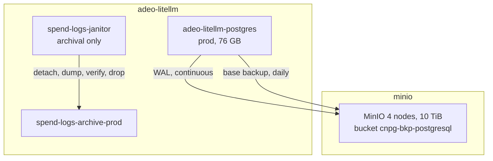

# Postgres Backup and Recovery

How the `adeo-litellm` Postgres cluster is protected, why the current state is not
protection, and the plan to bring it in line with the rest of the cluster.

## Summary

`adeo-litellm-postgres` holds the only copy of the prod spend logs (76 GB, 19.08M
rows) and has no backup of any kind. It is one of three CNPG clusters in this
cluster that are not enrolled in the org-wide backup convention, and it is the
only one of the three that holds data anyone would miss.

There are four VolumeSnapshots on disk from the migration on 2026-09-11. They are
the only recovery artifact that exists. They are not a backup, and they are about
to be deleted. The replacement is a CNPG `barmanObjectStore` backup into the
existing MinIO, which is the pattern six other clusters already use.

## What exists today

### The database

| Item | Value |
|------|-------|
| Cluster | `adeo-litellm/adeo-litellm-postgres` |
| Instances | 1 (no replica to fail over to) |
| Database | `litellm` (not `oicm`, which is a separate 8 MB DB) |
| Size | 76 GB |
| `LiteLLM_SpendLogs` | 83 partitions, 19.08M rows |
| Storage | 200 GB PGDATA + 50 GB WAL |
| Memory | request 2G, limit 8G (raised 2026-10-08 from 2G after 24 OOMKills) |

### The four snapshots

Taken 2026-09-11 during the migration off the old mlops Postgres. All are
`ReadyToUse`, all use the `longhorn-snapshot-retain` class, all are in
`adeo-litellm`.

| Snapshot | Source PVC | VolumeSnapshotContent | Actual bytes |
|----------|-----------|----------------------|--------------|
| `litellm-old-data-safety` | `old-litellm-postgres-data` | `snapcontent-525b0548` | 70.2 GiB |
| `litellm-old-wal-safety` | `old-litellm-postgres-wal` | `snapcontent-359e6a99` | 40.4 GiB |
| `litellm-recovery-data-v1` | `inspect-old-litellm-data` | `snapcontent-060e57e1` | 60.5 GiB |
| `litellm-recovery-wal-v1` | `inspect-old-litellm-wal` | `snapcontent-01429b1f` | 35.0 GiB |

They sit on four detached Longhorn volumes, which cost roughly 90 GB of actual
disk. The snapshot class is `Retain`, so none of this is reclaimed automatically.

### The archive is not a safety net

The spend-logs janitor detaches old partitions, dumps them, verifies the dump,
then drops them. Its ledger currently reads:

| State | Partitions | Rows dumped | Dump bytes |
|-------|-----------|-------------|-----------|
| `eligible` | 72 | 0 | 0 |
| `detached` | 1 | 0 | 0 |
| `dropped` | 2 | 87,498 | 22 MB |

Two things follow. The archive holds 22 MB of dumps for 87,498 rows, so it is
effectively empty. And `p20260724` was dropped with `artifact_uri IS NULL`, which
the state machine cannot produce, so at least one partition's data was lost by a
manual ledger edit rather than archived. The janitor is a cost-management tool for
a hot table, not a backup, and should not be treated as one.

### No other backup exists

- No `Backup` or `ScheduledBackup` object in `adeo-litellm`.
- `spec.backup` is unset on the cluster, so no WAL is being archived.
- No Longhorn `RecurringJob` anywhere in the cluster.
- The `default` Longhorn `BackupTarget` has an empty URL and `AVAILABLE: false`.
- One instance, so no streaming replica.
- The live Cluster object's `spec.bootstrap` reads `initdb`, because CNPG rewrote
  it after consuming the recovery block. The deployable manifest says `initdb`
  too, so applying it builds an empty database.

## Why one rolling snapshot is the wrong shape

The instinct to keep exactly one snapshot and overwrite it is reasonable for cost,
and wrong for a database, for four reasons.

A volume snapshot is a delta on the same Longhorn volume, on the same disks, in
the same cluster. If the volume or its filesystem is damaged, every later snapshot
inherits the damage, and the overwrite destroys the last known-good state. That
recovers from "a table was dropped an hour ago" and nothing else.

CNPG has no retention or garbage collection for volume snapshots. Retention
policies are available on object-store backups and not on snapshots, so
"overwrite it" would be a hand-written delete-and-recreate loop with no supported
mechanism behind it.

One restore point cannot answer "restore to before the bad migration but after
yesterday's load". An object-store backup with WAL archiving gives point-in-time
recovery to any second.

Snapshot restore lands on whatever StorageClass the PVC declares, which is how the
custom class below came to exist.

## The org convention that is already in place

The cluster already runs the right pattern. `adeo-litellm` is simply not enrolled.

MinIO runs in the `minio` namespace as a 4-node StatefulSet with 4 x 2560 GiB
volumes (10 TiB total) on the approved `longhorn-rwx-crypto-retain` class. It
serves `http://minio.minio.svc.cluster.local:9000` and holds the bucket
`cnpg-bkp-postgresql`, whose credentials live in the `obs-cnpg-bkp-postgresql-keys`
Secret.

Nine CNPG clusters exist. Six back up to that bucket with an identical spec:

| Namespace | Cluster | Backup |
|-----------|---------|--------|
| `api-gateway` | `apigateway-postgres` | yes |
| `keycloak` | `keycloak-postgresql` | yes |
| `kube-prometheus-stack` | `grafana-postgres` | yes |
| `mlops` | `mlops-postgres` | yes |
| `oichat` | `oichat-pg-cluster` | yes |
| `oicm-keycloak` | `oicm-keycloak-postgresql` | yes |
| `adeo-litellm` | `adeo-litellm-postgres` | **no** |
| `adeo-litellm` | `adeo-litellm-postgres-dev` | **no** |
| `mlops` | `notebook-proxy-postgresql` | no |

The shared spec, taken from `mlops-postgres`:

```yaml
spec:
  backup:
    barmanObjectStore:
      destinationPath: s3://cnpg-bkp-postgresql
      endpointURL: http://minio.minio.svc.cluster.local:9000
      s3Credentials:
        accessKeyId:
          name: cnpg-bkp-obs-credentials
          key: ACCESS_KEY_ID
        secretAccessKey:
          name: cnpg-bkp-obs-credentials
          key: SECRET_ACCESS_KEY
      data:
        compression: gzip
      wal:
        compression: gzip
    retentionPolicy: 5d
    target: prefer-standby
```

and the matching daily schedule:

```yaml
apiVersion: postgresql.cnpg.io/v1
kind: ScheduledBackup
metadata:
  name: adeo-litellm-postgres-backup
spec:
  cluster:
    name: adeo-litellm-postgres
  method: barmanObjectStore
  schedule: "0 0 0 * * *"
  immediate: true
  backupOwnerReference: self
```

`retentionPolicy: 5d` is the supported form of the "keep a short window and drop
the rest" idea. CNPG prunes base backups outside the window and keeps the WAL
needed to reach the window's start.

## Target architecture



Four layers, each doing one job.

**Layer 1, CNPG backup into MinIO.** The new piece. Gives point-in-time recovery,
survives loss of the node or the Longhorn volume because MinIO is separate
storage, needs no custom StorageClass, and matches six other clusters so the
existing runbook already covers it. CNPG writes to
`<destinationPath>/<clusterName>/`, so prod and dev are separated by cluster name
with no collision and no configuration.

**Layer 2, the janitor stays archival.** It solves hot-table cost, not disaster
recovery. The two are complementary and neither replaces the other.

**Layer 3, remove the custom StorageClass.** See below.

**Layer 4, retire the snapshots.** Keep all four until a CNPG backup has completed
and a restore from it has been tested. Then delete them, the four Longhorn volumes
behind them, and the two manifests in `deploy/recovery/`.

## The custom StorageClass

`longhorn-rwx-crypto-retain-recovery` was created for the migration and is used by
three live volumes.

| PVC | Volume | Size | Class | Replicas |
|-----|--------|------|-------|----------|
| `adeo-litellm-postgres-1` | `pvc-e3c393a0` | 200 GiB | `-recovery` | **1** |
| `adeo-litellm-postgres-1-wal` | `pvc-dd3a4074` | 50 GiB | `-recovery` | **1** |
| `spend-logs-archive-prod` | `pvc-8520e43a` | 200 GiB | `-recovery` | **1** |

It differs from the approved `longhorn-rwx-crypto-retain` in exactly one
parameter: `numberOfReplicas` is `1` instead of `3`. Everything else, including
encryption and the share-manager node selector, is identical.

So live prod PGDATA and WAL currently have no redundancy at all. A single replica
on a single disk is a single point of failure, and it is a larger risk than the
absence of a backup because it can be triggered by one disk rather than by
operator error. This is the most urgent item in this document.

Removing the class takes three steps, in this order.

1. Change `storageClass` in the manifests so new volumes use
   `longhorn-rwx-crypto-retain`. This affects nothing that already exists, because
   a StorageClass change never migrates a bound volume.
2. Raise the three existing volumes to 3 replicas directly on the Longhorn Volume
   resource. Longhorn rebuilds the additional replicas in place.
3. Delete the StorageClass once nothing references it.

The dev cluster already uses `longhorn-crypto-global`, so it is unaffected.

## Implementation order

1. Create the `cnpg-bkp-obs-credentials` Secret in `adeo-litellm`, copied from
   `mlops` so the same MinIO credentials are used rather than new ones.
2. Add the `backup` block and the `ScheduledBackup` to the prod manifests.
3. Apply, and confirm the first backup reaches `s3://cnpg-bkp-postgresql/adeo-litellm-postgres/`.
4. Restore into a throwaway cluster and check the row count. This is the gate for
   step 5. A backup that has never been restored from is a hypothesis.
5. Raise the three volumes to 3 replicas and delete the custom StorageClass.
6. Delete the four snapshots, the four Longhorn volumes, and `deploy/recovery/`.

Steps 1 to 4 need MinIO credentials. Steps 5 and 6 need nothing further.

## Risks

**Enabling WAL archiving restarts the primary.** `archive_mode` is a
postmaster-level setting that PostgreSQL cannot change without a restart, and CNPG
will roll the primary to apply it. The cluster is single-instance, so this is a
short outage. It belongs in a maintenance window. The gateway logs `Prisma DB
reconnect` and `DB transport error` for roughly 30 seconds and recovers on its
own.

**A single-replica volume cannot rebuild while it is the only copy.** Raising
replicas to 3 is safe on a healthy attached volume, but it does move data. Confirm
robustness is `healthy` before starting, and do one volume at a time.

**Retention is 5 days.** That matches the rest of the cluster, and it means a
problem noticed on day 6 has no base backup behind it. The 5-day window is a
deliberate org-wide choice, not a limit of the mechanism; raise it if the spend
logs need a longer recovery horizon.

**MinIO is in-cluster.** It is separate storage from the Postgres volumes, so it
survives disk and node loss, but it does not survive losing the whole cluster. A
true off-site copy is out of scope here and would be the next layer up.

## Deleting the old data

The four snapshots and their four Longhorn volumes are being removed as part of
step 6. The risks accepted, explicitly:

- Until step 4 passes, there is no recovery path for prod Postgres at all.
- The old mlops data is not a substitute. `mlops-postgres` still exists and is
  backed up, but its `oicm` database is 8 MB and contains no LiteLLM tables, so the
  spend logs are not in it.
- The archive PVC holds 22 MB of dumps for 87,498 rows, so it cannot stand in for
  the snapshots either.

Deleting a `Released` PV with a `Retain` reclaim policy does not free the disk. The
Longhorn Volume resource must be deleted as well, or the space is never reclaimed.

## Related

- `deploy/prod/litellm-postgres-cluster.yaml`, the deployable cluster spec
- `deploy/prod/spend-logs-janitor/`, the archival CronJob
- `docs/incidents/2026-09-08-postgres-disk-full/`, why the janitor exists
